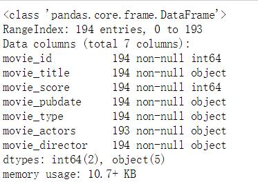
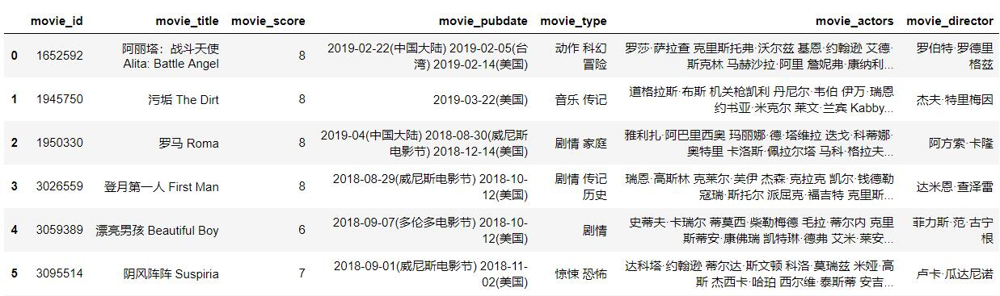
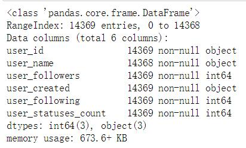
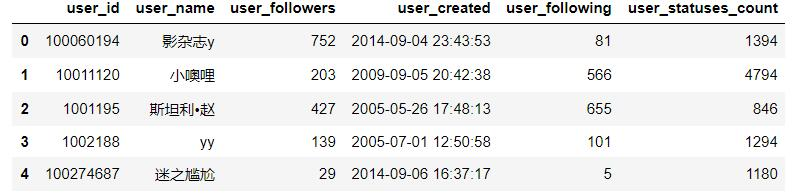
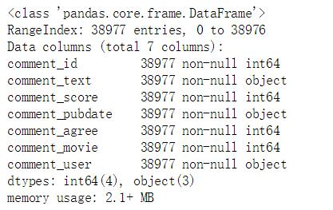
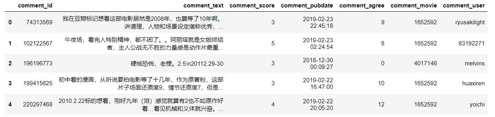

# 豆瓣电影短评分析
包含了14369位用户对194部电影作出的38977个短评+16166个影评

##一、数据

PS: 如影评评分、用户粉丝数等数据截止至2019年4月14日

### 电影数据	movie.csv

包含字段：
	
- 电影ID movie_id	(ID编号来源于豆瓣数据库)
- 电影名称 movie_title
- 电影评分	movie_score
- 电影上映时间	movie_pubdate
- 电影类型	movie_type	(不同类别用空格` `符号隔开)
- 电影演员	movie_actors	(不同演员用空格` `符号隔开)
- 电影导演	movie_director	(不同导演用空格` `符号隔开)

数据大小：

部分数据内容：

### 用户数据 user.csv

包含字段：

- 用户ID		user_id
- 用户昵称	user_name
- 用户粉丝数	user_followers
- 用户创建时间	user_created
- 用户关注数	user_following
- 用户广播数	user_statuses_count

数据大小：

部分数据内容：

### 短评数据 comment.csv

PS:短评发起者即comment_user，可能在user_csv中找不到对应的user_id，可以运行爬虫重新爬去下

包含字段：

- 短评ID		comment_id
- 短评内容	comment_text
- 短评评分	comment_score
- 短评支持数	comment_agree
- 短评评论对象(外键: 电影ID)	comment_movie
- 短评发起者(外键: 用户ID)		comment_user

数据大小：

部分数据内容：

